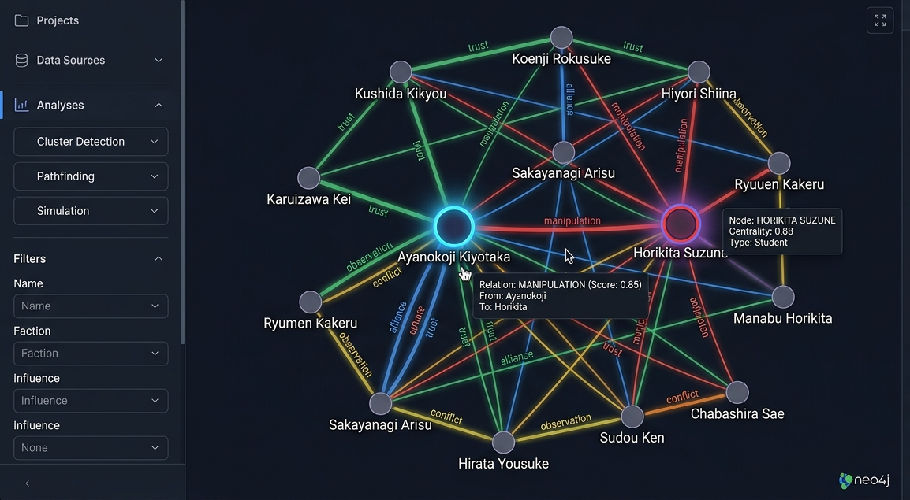

# AyanoGOAT

Strategic social-network simulator. White Room intelligence terminal.

---
<p align="center">
  
</p>

<h1 align="center">AyanoGOAT</h1>

<p align="center">
  <i>Graph Intelligence • Behavioral ML • Knowledge Networks • Strategic Systems</i>
</p>

---

<p align="center">
  
  
  
  
</p>

---

## What is AYANOGOAT?

A full-stack **machine learning + graph intelligence system** that models complex social dynamics using knowledge graphs, behavioral embeddings, and network analytics.

It transforms interactions, influence patterns, alliances, and strategic behavior into an evolving graph-powered intelligence system.

---

## Core System

- Graph-based relationship modeling (Neo4j)
- Behavioral embeddings (Sentence Transformers)
- Network analytics (centrality, communities, influence paths)
- Semantic similarity search
- Interactive graph exploration dashboard

---

## Architecture Snapshot

```text
Frontend (Next.js + TS)
        ↓
FastAPI Backend (ML + Graph APIs)
        ↓
Neo4j Graph Database
        ↓
Analytics Engine (NetworkX + Node2Vec + Sklearn)

Key Capabilities
Influence chain detection
Manipulation & alliance tracking
Community detection in networks
Archetype clustering via embeddings
Strategic similarity matching
Timeline-based interaction analysis
```
---

## Tech Stack

Python • FastAPI • Next.js • TypeScript • Neo4j • NetworkX
Node2Vec • Sentence Transformers • Scikit-Learn • Docker

Intelligence Visuals
<p align="center">   </p> <p align="center">  </p>

## Concept

A system designed to simulate and analyze strategic intelligence networks through machine learning + graph theory.
---
## Quick Start

```bash
unzip ayanokoji_protocol.zip
cd ayanokoji_protocol
docker compose up --build
```

| Service  | URL                         |
|----------|-----------------------------|
| Frontend | http://localhost:3000       |
| API Docs | http://localhost:8000/docs  |
| Neo4j    | http://localhost:7474       |

Neo4j credentials: `neo4j` / `ayanokoji_protocol`

---

## Architecture

```
Frontend  (Next.js 15, React 18, TypeScript, Tailwind, Framer Motion)
    |
    | HTTP /backend/* (rewrites via next.config.ts)
    v
Backend   (FastAPI, Python 3.12, Pydantic)
    |
    | Bolt protocol
    v
Neo4j 5.x (graph database — auto-seeded on startup)

ML layer (sentence-transformers, networkx, node2vec, scikit-learn)
```

---

## Folder Structure

```
ayanokoji_protocol/
├── docker-compose.yml
├── backend/
│   ├── Dockerfile
│   ├── start.sh               # waits for Neo4j, seeds DB, starts API
│   ├── requirements.txt
│   ├── main.py                # FastAPI app + router registration
│   ├── api/                   # route handlers
│   │   ├── graph.py
│   │   ├── characters.py
│   │   ├── simulation.py
│   │   ├── strategist.py
│   │   ├── similarity.py
│   │   └── timeline.py
│   ├── services/              # business logic
│   │   ├── graph_service.py
│   │   ├── simulation_service.py
│   │   ├── embedding_service.py
│   │   └── timeline_service.py
│   ├── ml/                    # analytics engines
│   │   ├── analytics.py       # PageRank, betweenness, community detection
│   │   ├── embeddings.py      # sentence-transformers cosine similarity
│   │   └── node2vec_model.py  # structural graph embeddings
│   ├── schemas/               # Pydantic models
│   ├── graph/                 # Neo4j client
│   ├── database/              # driver singleton
│   ├── seed/                  # dataset + seeder
│   └── utils/
└── frontend/
    ├── Dockerfile
    ├── package.json
    ├── next.config.ts          # /backend/* rewrites to FastAPI
    ├── tailwind.config.ts
    ├── app/
    │   ├── layout.tsx
    │   ├── page.tsx            # landing
    │   ├── dashboard/page.tsx  # force graph + agent list
    │   ├── character/[id]/page.tsx
    │   ├── simulation/page.tsx
    │   └── strategist/page.tsx
    ├── components/
    │   ├── InteractiveGraph.tsx
    │   ├── CharacterProfilePanel.tsx
    │   ├── StrategySimulationPanel.tsx
    │   ├── UserStrategyPanel.tsx
    │   ├── TimelineSlider.tsx
    │   ├── SearchBar.tsx
    │   └── AnimatedRelationshipPath.tsx
    ├── lib/api.ts              # typed API client
    ├── store/useStore.ts       # Zustand global state
    └── types/index.ts          # shared TypeScript interfaces
```

---

## API Reference

### Graph
| Method | Path                      | Description                        |
|--------|---------------------------|------------------------------------|
| GET    | /graph/                   | Full graph nodes and links         |
| GET    | /graph/analytics          | PageRank, betweenness, communities |
| GET    | /graph/hidden-influencers | Bridge nodes with high betweenness |
| GET    | /graph/embeddings         | Node2Vec structural embeddings     |

### Characters
| Method | Path                                        | Description              |
|--------|---------------------------------------------|--------------------------|
| GET    | /characters/                                | List all agents          |
| GET    | /characters/{id}                            | Full character profile   |
| GET    | /characters/{id}/relationships              | Outgoing relationships   |
| GET    | /characters/{src}/influence-path/{tgt}      | Shortest influence path  |
| POST   | /characters/{id}/interact                   | Contextual dialogue      |

### Simulation
| Method | Path                           | Description                    |
|--------|--------------------------------|--------------------------------|
| POST   | /simulation/run                | Influence propagation          |
| POST   | /simulation/alliance-stability | Predict alliance stability     |

### Strategist
| Method | Path                    | Description                        |
|--------|-------------------------|------------------------------------|
| POST   | /strategist/profile     | Create behavioral archetype        |
| GET    | /strategist/{user_id}   | Retrieve stored profile            |

### Similarity
| Method | Path                  | Description                            |
|--------|-----------------------|----------------------------------------|
| POST   | /similarity/find      | Find agents similar to query text      |
| POST   | /similarity/compare   | Cosine similarity between two agents   |
| GET    | /similarity/archetypes| List all strategic archetypes          |

### Timeline
| Method | Path                     | Description                      |
|--------|--------------------------|----------------------------------|
| GET    | /timeline/events         | All events across all seasons    |
| GET    | /timeline/events/{n}     | Events for season n (1-3)        |
| POST   | /timeline/advance        | Advance timeline, decay weights  |

---

## Environment Variables

| Variable          | Default                    | Context          |
|-------------------|----------------------------|------------------|
| NEO4J_URI         | bolt://neo4j:7687          | backend          |
| NEO4J_USER        | neo4j                      | backend          |
| NEO4J_PASSWORD    | ayanokoji_protocol         | backend          |
| BACKEND_URL       | http://backend:8000        | frontend (Docker)|

For local development without Docker, set `BACKEND_URL=http://localhost:8000` in `frontend/.env.local`.

---

## Dataset

- **25 characters** across Class A, B, C, D, Faculty, Student Council
- **115 relationships** with types: MANIPULATES, ALLIES_WITH, RIVALS, PROTECTS, DECEIVES, DISTRUSTS, INFLUENCES
- **12 timeline events** across 3 seasons
- Each relationship carries `weight`, `trust`, `confidence`, and `timestamp`

---

## ML Systems

**Graph Analytics** (networkx)
- PageRank influence scoring
- Betweenness centrality
- Community detection (Greedy Modularity)
- Hidden influencer detection (high betweenness, low degree)
- Shortest influence path

**Embedding Engine** (sentence-transformers `all-MiniLM-L6-v2`)
- Character behavioral embeddings
- Strategist behavioral profiling
- Cosine similarity matching
- Archetype classification

**Structural Embeddings** (node2vec)
- Graph topology encoding
- Structural similarity between agents
- Falls back to spectral embedding if unavailable

**Simulation Engine**
- Probabilistic influence propagation (modified decay-diffusion model)
- Strategy multipliers (manipulation, alliance, observation, direct)
- Alliance instability scoring
- Manipulation chain detection via shortest paths

---

## Troubleshooting

**Neo4j not starting**
- Allow 60s for Neo4j initialization. The backend retries for 2 minutes.
- Check logs: `docker compose logs neo4j`

**Backend seeding fails**
- Ensure Neo4j is healthy first: `docker compose logs backend`
- Re-run seeder manually: `docker compose exec backend python -m seed.seeder`

**Frontend cannot reach backend**
- The frontend proxies `/backend/*` to the FastAPI service via Next.js rewrites.
- For local dev: ensure `BACKEND_URL=http://localhost:8000` in `frontend/.env.local`
- For Docker: `BACKEND_URL` is set to `http://backend:8000` in `docker-compose.yml`

**Graph renders empty**
- Confirm seeder ran: `docker compose exec backend python -c "from database.connection import get_driver; d=get_driver(); print(d.verify_connectivity())"`
- Re-seed: `docker compose exec backend python -m seed.seeder`

**sentence-transformers model download slow**
- The `all-MiniLM-L6-v2` model (~90MB) downloads on first use.
- Subsequent requests use the cached model.

---

## Tech Stack

| Layer      | Technology                                         |
|------------|----------------------------------------------------|
| Frontend   | Next.js 15, React 18, TypeScript, Tailwind CSS    |
| Animation  | Framer Motion                                      |
| Graph UI   | react-force-graph-2d                               |
| State      | Zustand v5                                         |
| Backend    | FastAPI, Python 3.12, Pydantic v2                  |
| Database   | Neo4j 5.x                                          |
| ML         | sentence-transformers, networkx, node2vec, sklearn |
| Infra      | Docker, Docker Compose                             |
